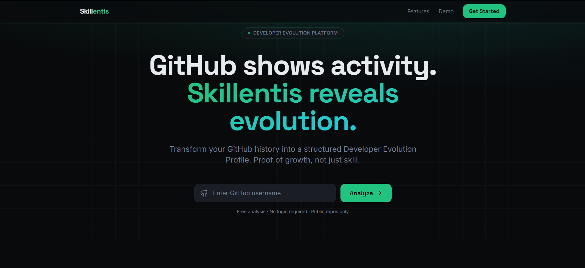

# Skillentis V2.0

### GitHub-based Developer Evolution Analysis

Skillentis analyzes public GitHub activity and transforms it into a **structured developer evolution profile**.

Instead of focusing on vanity metrics like **stars** or **raw commit counts**, Skillentis highlights:

- growth over time  
- technical consistency  
- structural maturity  

> GitHub shows activity.  
> **Skillentis reveals evolution.**

---

# Overview

Technical hiring is noisy.

Recruiters often struggle to evaluate GitHub profiles because repositories vary in **structure, scope, and maturity**.

Skillentis attempts to solve this by converting GitHub history into a **clear evolution signal**.

The platform analyzes:

- Development consistency  
- Repository structure  
- Project progression  
- Technology breadth  
- Engineering maturity signals  

The goal is to provide a **more meaningful view of developer growth**, rather than static snapshots.

---

# Core Idea

Traditional GitHub signals include:

- commit count  
- stars  
- followers  
- contribution graph  

These metrics show **activity**, not **technical evolution**.

Skillentis focuses instead on:

- growth trajectory  
- project maturity  
- development patterns  
- structural engineering practices  

The idea is simple:

> Developers don't just accumulate activity.  
> **They evolve.**

---

# Current Version (V2)

Skillentis V2 introduces a **clearer product positioning** focused on developer evolution rather than simple scoring.

Key improvements include:

- redesigned landing page  
- clearer product positioning  
- improved developer analysis flow  
- structured evolution profile concept  
- cleaner UI architecture  

This version represents a step toward building a **developer evolution platform**, not just a GitHub analyzer.

---

# Tech Stack

### Frontend

- React
- TypeScript
- Vite
- TailwindCSS
- shadcn/ui

### Platform

- GitHub public repository analysis
- serverless functions
- modern frontend architecture

---

# Project Status

Skillentis is currently in **early public testing**.

The goal of this phase is to validate:

- developer interest  
- recruiter usefulness  
- clarity of the evolution model  

Feedback from **developers and hiring professionals** is extremely valuable.

---

# Live Demo

Try the platform:

https://www.skillentisapp.com/

Enter a **GitHub username** to generate a developer evolution profile.

- No login required  
- Only **public repositories** are analyzed  

---

# Vision

Skillentis explores a simple idea:

> **Developer skill is not static. It evolves.**

The long-term goal is to build a system that highlights **technical growth**, not just technical snapshots.

---

# Author

**Damian Nogueira**  
Software Development Student — UTN
Frontend AI Engineering  — FlyRank AI

GitHub  
https://github.com/damiannogueira

LinkedIn  
https://www.linkedin.com/in/damián-ignacio-nogueira-a8446b353/

---

💡 If you're a **developer or recruiter** and want to share feedback, feel free to open an issue or reach out.
